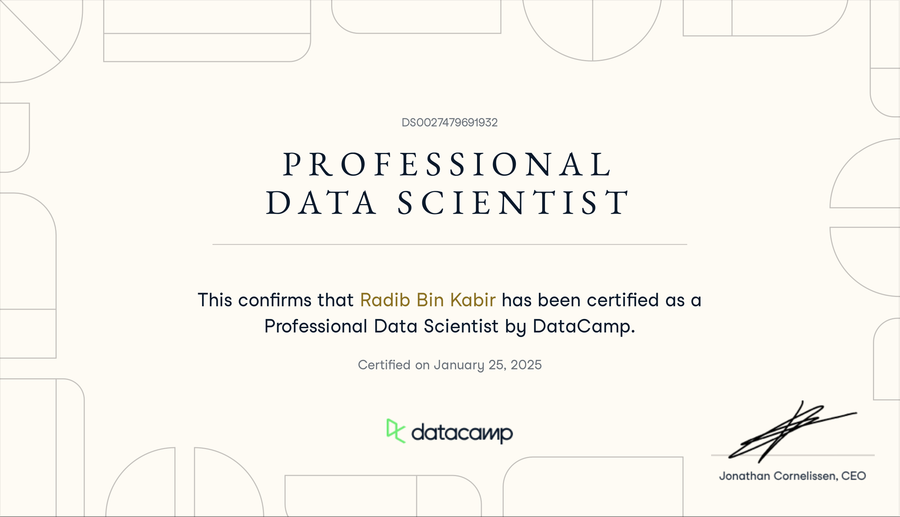

# Datacamp-Data-Scientist-Certification

This repository showcases my achievement of the **DataCamp Professional Data Scientist Certificate**, along with relevant coursework and a sample project demonstrating my skills in **data analysis, visualization, and machine learning**.  

## 🏆 Certification Details  
- **Certificate ID:** DS0027479691932  
- **Issued By:** DataCamp  
- **Completion Date:** January 2025  
  
## 📂 Repository Contents  

| File | Description |
|------|------------|
| `Datacamp_certificate_DS0027479691932.pdf` | Official DataCamp Professional Data Scientist Certificate. |
| `Datacamp_notebook.ipynb` | A project showcasing data analysis and machine learning techniques learned during the certification. |
| `Recipe Site Traffic - Presentation.pdf` | A presentation analyzing the website traffic data, demonstrating data visualization and insights extraction. |
| `recipe_site_traffic_2212.csv` | Dataset used for analysis in the notebook and presentation. |
